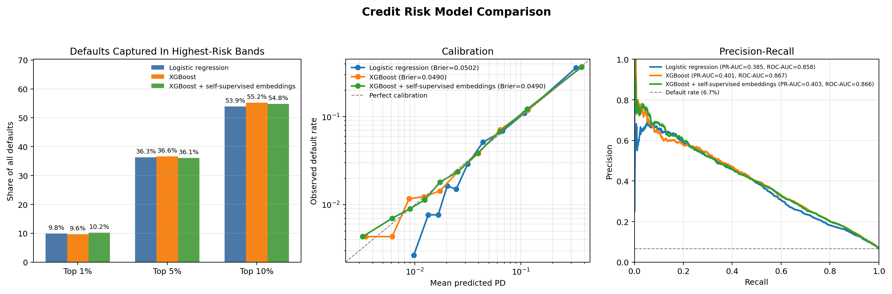
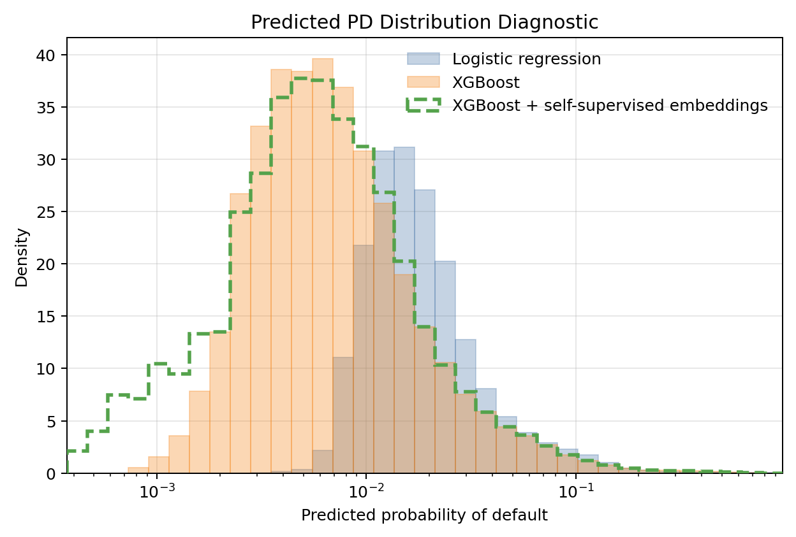

# Credit Risk Modeling: Supervised ML + Self-Supervised Pretraining

A probability-of-default case study comparing logistic regression, XGBoost,
and XGBoost augmented with PyTorch embeddings learned without default labels.

The self-supervised extension applies a pretraining principle used in modern
GenAI: learn representations from unlabeled data and then evaluate them on a
downstream task. On this dataset, the augmented model performs close to raw
XGBoost.

The **MLOps** layer provides simple command-line checks, configuration-driven
training and reproducible evaluation outputs, so the workflow can be rerun
consistently from a clean checkout.



### What this demonstrates

- Supervised ML: logistic regression and XGBoost probability-of-default models.
- GenAI-adjacent learning: masked-feature self-supervised pretraining with a
  PyTorch autoencoder.
- MLOps: configuration-driven checks, training, evaluation and saved artifacts.

### Method

1. Split and preprocess borrower data without validation leakage.
2. Train logistic regression and XGBoost on the original features.
3. Mask borrower features, train the autoencoder to reconstruct them without
   default labels, and add its eight-dimensional embeddings to XGBoost.

The three models are evaluated using PR-AUC, ROC-AUC, calibration/Brier score
and default capture in the highest-risk groups. PR-AUC is calculated on the
ordinary linear recall scale.

### Result

Raw XGBoost gives the best overall balance. XGBoost plus self-supervised
embeddings performs very similarly. The experiment demonstrates self-supervised
representation learning and rigorous evaluation, but not a proven performance
improvement.

<details>
<summary>Predicted probability distributions</summary>



</details>

### Run

Place the Give Me Some Credit data under `data/GiveMeSomeCredit/`, then run:

```bash
pip install -r requirements.txt

python mlops/scripts/run_checks.py
python mlops/scripts/train.py
python mlops/scripts/evaluate.py

python GenAI_impl/self_supervised_tabular/smoke_test.py
python GenAI_impl/self_supervised_tabular/run_experiment.py
python GenAI_impl/self_supervised_tabular/make_interview_figure.py
```

### Scope

This is a portfolio case study using a public Kaggle dataset. It is not a
production credit-decision system and does not include external validation,
fairness testing, regulatory validation or production drift monitoring.
